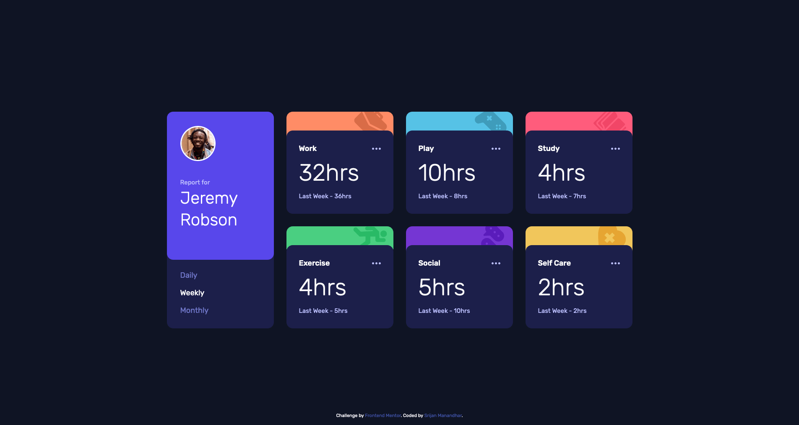

# Frontend Mentor - Time tracking dashboard solution

This is a solution to the [Time tracking dashboard challenge on Frontend Mentor](https://www.frontendmentor.io/challenges/time-tracking-dashboard-UIQ7167Jw). Frontend Mentor challenges help you improve your coding skills by building realistic projects.

## Table of contents

- [Overview](#overview)
  - [The challenge](#the-challenge)
  - [Screenshot](#screenshot)
  - [Links](#links)
- [My process](#my-process)
  - [Built with](#built-with)
  - [What I learned](#what-i-learned)
  - [Useful resources](#useful-resources)
- [Author](#author)

## Overview

### The challenge

Users should be able to:

- View the optimal layout for the site depending on their device's screen size
- See hover states for all interactive elements on the page
- Switch between viewing Daily, Weekly, and Monthly stats

### Screenshot




### Links

- Solution URL: [https://github.com/srijanss/time-tracking-dashboard](https://github.com/srijanss/time-tracking-dashboard)
- Live Site URL: [https://srijanss.github.io/time-tracking-dashboard/](https://srijanss.github.io/time-tracking-dashboard/)

## My process

### Built with

- Semantic HTML5 markup
- CSS custom properties
- Flexbox
- CSS Grid
- Mobile-first workflow
- Web components
- [Vite](https://vitejs.dev/) - Lightweight frontend tooling
- [PostCSS](https://postcss.org/) - Tool to transform CSS using plugins

### What I learned

```html
<time-frame-item data-timeframes="daily:weekly:monthly"></time-frame-item>
```

```js
export default class TimeFrameItem extends HTMLElement {
  constructor() {
    super();
    this.defaultTimeFrame = defaultTimeFrame;
  }

  connectedCallback() {
    this.render();
    this.handleTimeframeChange();
  }
  ...
}
```

I tried using web components to build this project. Encapsulating HTML, CSS and Javasript into one component and making it reusable made me try web components. And important thing was I can use any class names in this component and it will not affect the styles of main page. However, CSS variables defined in main file were accessible which was very helpful. I didn't have to redefine it in my component's CSS.
I had decided to use web components, but I was not okay with adding css in javascript files. Finally, I found a solution that vite provides to import css inline as strings. That way I was able to create separate css files and import it into my components javascript.

### Useful resources

- [Web Components](https://developer.mozilla.org/en-US/docs/Web/API/Web_components) - This helped me for understanding web components.

## Author

- Website - [Srijan Manandhar](https://github.com/srijanss)
- Frontend Mentor - [@srijanss](https://www.frontendmentor.io/profile/srijanss)
